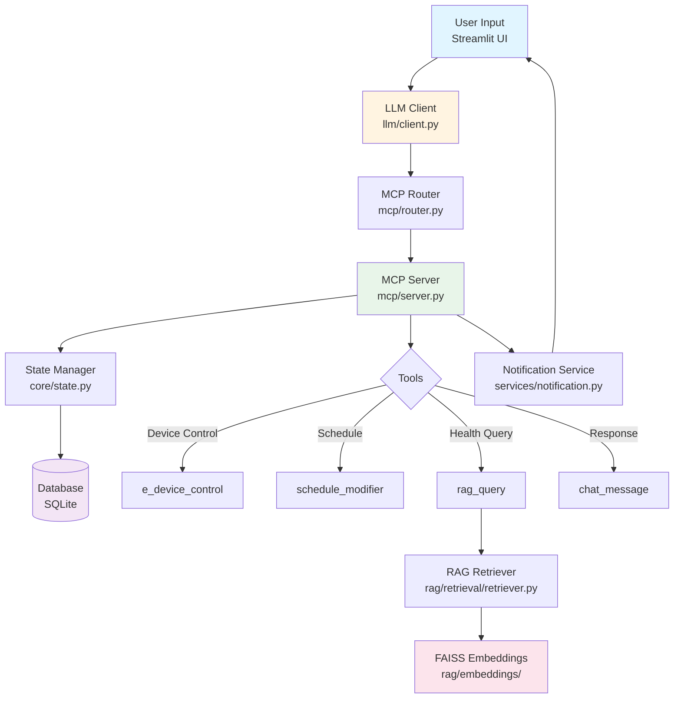

# MCP Smart Environment System

A Streamlit-based smart environment assistant for elderly/disabled users. The system uses LLM (via Ollama) to control devices, manage schedules, and provide health-related guidance through RAG (Retrieval-Augmented Generation).

## Project Overview

This project addresses the challenge of providing accessible smart home control and health guidance for elderly and disabled users. Traditional smart home interfaces often require complex app navigation or voice commands that may be difficult for users with mobility or cognitive limitations.

**Problem Statement**: Elderly and disabled users need an intuitive, natural language interface to control their home environment and receive personalized health recommendations without navigating complex menus or remembering specific commands.

**Solution**: A conversational AI assistant that:
- Understands natural language requests (e.g., "Turn on the light", "What should I eat for breakfast?")
- Automatically manages daily schedules with proactive notifications
- Provides health guidance tailored to user conditions via RAG (Retrieval-Augmented Generation)
- Controls IoT devices across multiple rooms through simple chat interactions

**Target Users**: Elderly individuals and people with disabilities who benefit from:
- Voice/text-based interaction instead of complex UIs
- Automated schedule reminders and device management
- Health-aware recommendations based on medical conditions
- Proactive assistance (e.g., notifications about devices left on)

## Features

- **Device Control**: Control lights, AC, TV, Fan, and Alarm across multiple rooms
- **Schedule Management**: Add, modify, and delete daily schedule items
- **Health Knowledge Base**: RAG system provides tailored health recommendations based on user conditions
- **Notification System**: Proactive house checks and activity reminders
- **Natural Language Interface**: Chat-based interaction powered by LLM

## Prerequisites

**Docker and Docker Compose are required.** No local Python installation needed.

- **Docker** 20.10+ ([Install Docker](https://docs.docker.com/get-docker/))
- **Docker Compose** 2.0+ (included with Docker Desktop)

## Quick Start

```bash
# Clone the repository
git clone <repo-url>
cd mcp_llm

# Copy environment file (optional - defaults work)
cp .env.example .env

# Start all services
docker compose up --build
```

The application will be available at `http://localhost:8501`

**First Run:** The required model (`qwen2.5:7b`) will be automatically downloaded during startup. This may take a few minutes depending on your internet connection. The model is persisted in a Docker volume, so it only needs to be downloaded once.

## Model Requirements

### LLM Model

**Default Model**: `qwen2.5:7b`
- **Size**: ~4.4 GB (quantized)
- **Quantization**: Uses Ollama's default quantization (typically Q4_K_M)
- **Context Window**: 32K tokens (system uses 8K context window)
- **Performance**: Good balance of quality and speed for conversational AI

**Alternative Models** (modify `MODEL_NAME` in `.env`):
- `deepseek-r1:latest` - Better reasoning, larger model (~5.2 GB)
- `llama3.2:3b` - Smaller, faster, less capable
- `mistral:7b` - Alternative 7B model

### Hardware Requirements

**Minimum**:
- **GPU**: NVIDIA GPU with 6GB+ VRAM (recommended for reasonable performance)
- **RAM**: 8GB system RAM
- **Storage**: 10GB free space (for model + Docker images)

**Recommended**:
- **GPU**: NVIDIA GPU with 8GB+ VRAM (RTX 3060, RTX 4060, or better)
- **RAM**: 16GB system RAM
- **Storage**: 20GB+ free space

**CPU-Only Mode** (not recommended):
- The system can run on CPU, but inference will be very slow (10-30 seconds per response)
- Requires 16GB+ RAM
- Set `NVIDIA_VISIBLE_DEVICES=""` in `docker-compose.yml` to disable GPU

### Quantization

Models are automatically quantized by Ollama:
- **Q4_K_M** (4-bit): Default for 7B models, good quality/size balance
- **Q8_0** (8-bit): Better quality, larger size
- **F16** (16-bit): Best quality, largest size

The default quantization is sufficient for this application. No manual quantization configuration needed.

## Architecture

### High-Level System Flow



### Docker Services Architecture

The system runs in Docker with the following services:

```
┌─────────────────┐
│   Streamlit     │  Port 8501
│   Application   │  ──────────┐
└────────┬────────┘              │
         │                       │
         │ HTTP                  │ User
         │                       │ Browser
┌────────▼────────┐              │
│     Ollama      │  Port 11434  │
│   LLM Service   │              │
└─────────────────┘              │
                                  │
┌─────────────────┐              │
│  SQLite DB      │  Volume      │
│  (data/)        │  Mount       │
└─────────────────┘              │
                                  │
┌─────────────────┐              │
│  RAG Embeddings │  Volume      │
│  (rag/)         │  Mount       │
└─────────────────┘              │
```

### Services

1. **app** (Streamlit Application)
   - Python application serving the web UI
   - Connects to Ollama service for LLM processing
   - Uses SQLite database for state persistence
   - Accesses RAG embeddings for health knowledge

2. **ollama** (LLM Service)
   - Runs Ollama server for language model inference
   - Models are persisted in Docker volume `ollama_data`

3. **ollama-init** (Model Initialization)
   - Automatically checks for and downloads the required model on first run
   - Runs once after Ollama service is healthy
   - Skips download if model already exists in the volume

## Configuration

Configuration is done via environment variables in `.env` file.

### Required Variables

- `OLLAMA_HOST`: Ollama service URL (default: `http://ollama:11434` in Docker)
- `MODEL_NAME`: LLM model name (default: `qwen2.5:7b`)

### Optional Variables

- `DATABASE_PATH`: SQLite database path (default: `data/smart_environment.db`)
- `DATABASE_BACKUP_DIR`: Backup directory (default: `data/backups`)
- `ENABLE_DATABASE_LOGGING`: Enable SQL logging (default: `false`)
- `USE_COMPACT_PROMPT`: Use compact prompts (default: `false`)
- `STREAMLIT_SERVER_PORT`: Streamlit port (default: `8501`)
- `STREAMLIT_SERVER_ADDRESS`: Streamlit address (default: `0.0.0.0`)

See `.env.example` for all available options.

## Usage

1. **Start the system:**
   ```bash
   docker compose up --build
   ```

2. **Access the application:**
   - Open `http://localhost:8501` in your browser

3. **Interact via chat:**
   - Ask questions: "What devices are on?"
   - Control devices: "Turn on the light"
   - Manage schedule: "I have a meeting at 14:00"
   - Get health advice: "What should I eat for breakfast?" (if user has health conditions)

4. **Room Map**: Click on rooms in the left panel to change user location

5. **Schedule**: View and manage daily schedule items

## Docker Commands

### Start Services
```bash
docker compose up --build
```

### Start in Background
```bash
docker compose up -d --build
```

### View Logs
```bash
docker compose logs -f
```

### Stop Services
```bash
docker compose down
```

### Stop and Remove Volumes
```bash
docker compose down -v
```

### Rebuild After Code Changes
```bash
docker compose up --build
```

### Access Application Container
```bash
docker compose exec app bash
```

### Access Ollama Container
```bash
docker compose exec ollama bash
```

## Data Persistence

- **Database**: Stored in `data/` directory (mounted as volume)
- **Ollama Models**: Stored in Docker volume `ollama_data`
- **RAG Embeddings**: Included in image, read-only mount

To reset the database:
```bash
docker compose down
rm -rf data/*.db
docker compose up --build
```

## Troubleshooting

### Application Won't Start

**Check service status:**
```bash
docker compose ps
```

**View logs:**
```bash
docker compose logs app
docker compose logs ollama
```

### Ollama Connection Issues

**Verify Ollama is running:**
```bash
docker compose ps ollama
```

**Check Ollama health:**
```bash
docker compose exec ollama curl http://localhost:11434/api/tags
```

**Verify model is available:**
```bash
docker compose exec ollama ollama list
```

**Check model initialization logs:**
```bash
docker compose logs ollama-init
```

### Port Already in Use

If port 8501 is already in use, change it in `.env`:
```env
STREAMLIT_SERVER_PORT=8502
```

Then update `docker-compose.yml` port mapping:
```yaml
ports:
  - "8502:8501"
```

### RAG System Not Working

RAG embeddings are included in the repository. If issues occur:
- Verify `rag/embeddings/faiss_index.bin` exists
- Verify `rag/embeddings/id_to_chunk.json` exists
- Check application logs: `docker compose logs app | grep RAG`

### Database Issues

**Reset database:**
```bash
docker compose down
rm -rf data/*.db data/backups/*
docker compose up --build
```

**Check database file:**
```bash
ls -lh data/*.db
```

### Build Issues

**Clear Docker cache and rebuild:**
```bash
docker compose build --no-cache
docker compose up
```

**Check Docker resources:**
```bash
docker system df
docker system prune  # Remove unused resources
```

## Development

### Project Structure

```
mcp_llm/
├── Dockerfile              # Application container definition
├── docker-compose.yml      # Service orchestration
├── .dockerignore           # Build exclusions
├── .env.example            # Environment variable template
├── requirements.txt        # Python dependencies
├── app.py                  # Streamlit UI entry point (~1982 lines)
├── config.py               # Configuration constants and environment variables
│
├── core/                   # Core business logic
│   ├── state.py           # State management (devices, location, schedules)
│   └── activity_derivation.py  # Maps activities to device actions/locations
│
├── database/               # Database layer (SQLite)
│   ├── models.py          # SQLAlchemy models
│   ├── manager.py         # Database operations
│   └── migrations/        # Database migration scripts
│
├── llm/                    # LLM interaction layer
│   ├── client.py          # Ollama client and tool call parsing
│   └── prompts.py         # System prompts for LLM
│
├── mcp/                    # MCP (Model Context Protocol) tools
│   ├── server.py          # MCP tool implementations
│   └── router.py          # Routes LLM tool calls to server
│
├── rag/                    # RAG (Retrieval-Augmented Generation) system
│   ├── data/chunks/       # Health knowledge text chunks
│   ├── embeddings/        # Pre-computed FAISS embeddings (included in repo)
│   └── retrieval/         # Retrieval logic and similarity search
│
├── services/               # Application services
│   └── notification.py    # Proactive notifications and house checks
│
├── utils/                  # Utility modules
│   └── safety_logger.py   # Logging for tool calls and safety features
│
├── tests/                  # Test suite
│   └── test_mcp_router.py # MCP router test examples
│
├── scripts/                # Utility scripts
│   └── init-ollama-model.sh  # Model initialization script
│
└── data/                   # Runtime data (not in git)
    ├── smart_environment.db  # SQLite database
    └── backups/            # Database backups
```

**Directory Purposes**:
- **`core/`**: Business logic for state management and activity-to-device mapping
- **`database/`**: Data persistence layer using SQLAlchemy
- **`llm/`**: LLM communication, prompt management, and response parsing
- **`mcp/`**: MCP protocol implementation - tools that LLM can call
- **`rag/`**: Health knowledge retrieval system using FAISS embeddings
- **`services/`**: High-level application services (notifications, house checks)
- **`utils/`**: Shared utility functions
- **`tests/`**: Test code and examples

### Local Development Setup (Without Docker)

For development without Docker:

1. **Install Python 3.11+** and create virtual environment:
   ```bash
   python -m venv venv
   source venv/bin/activate  # On Windows: venv\Scripts\activate
   ```

2. **Install dependencies**:
   ```bash
   pip install -r requirements.txt
   ```

3. **Install and run Ollama locally**:
   - Download from [ollama.ai](https://ollama.ai)
   - Run: `ollama pull qwen2.5:7b`
   - Start Ollama: `ollama serve`

4. **Set environment variables** (or create `.env` file):
   ```bash
   export OLLAMA_HOST=http://localhost:11434
   export MODEL_NAME=qwen2.5:7b
   ```

5. **Run the application**:
   ```bash
   streamlit run app.py
   ```

### Making Code Changes

1. Edit code files
2. Rebuild and restart:
   ```bash
   docker compose up --build
   ```

### Running Tests

Test examples are in `tests/` directory:
```bash
# Run MCP router tests
python -m tests.test_mcp_router
```

### Accessing Logs

```bash
# All services
docker compose logs -f

# Specific service
docker compose logs -f app
docker compose logs -f ollama
```

## Key Components

### LLM Client (`llm/client.py`)
- Handles communication with Ollama
- Parses LLM responses into tool calls
- Manages conversation context and summarization

### MCP Server (`mcp/server.py`)
- Implements MCP protocol tools
- Executes device control and schedule modifications
- Integrates with RAG system for health queries

### State Manager (`core/state.py`)
- Manages device states, user location, and schedules
- Handles schedule cloning and one-time events

### RAG System (`rag/`)
- Retrieves relevant health knowledge based on user queries
- Uses FAISS for similarity search
- Provides context-aware health recommendations

## MCP Tools Documentation

The LLM can call the following tools through the MCP (Model Context Protocol) interface:

### 1. `chat_message`
Send a text message to the user.

**Arguments**:
- `message` (string, required): Message content to display

**Example**:
```json
{
  "tool": "chat_message",
  "arguments": {
    "message": "The bedroom light is now ON."
  }
}
```

### 2. `e_device_control`
Control electrical devices (turn ON or OFF).

**Arguments**:
- `room` (string, required): Room name ("Bedroom", "Bathroom", "Kitchen", "Living Room")
- `device` (string, required): Device name ("Light", "AC", "TV", "Fan", "Alarm")
- `action` (string, required): "ON" or "OFF"

**Example**:
```json
{
  "tool": "e_device_control",
  "arguments": {
    "room": "Bedroom",
    "device": "Light",
    "action": "ON"
  }
}
```

### 3. `schedule_modifier`
Add, delete, or modify schedule items.

**Arguments**:
- `modify_type` (string, required): "add", "delete", or "change"
- `time` (string, required for add/delete): Time in HH:MM format (e.g., "14:00")
- `activity` (string, required for add): Activity name (e.g., "Breakfast", "Meeting")
- `old_time` (string, required for change): Original time to modify
- `old_activity` (string, optional for change): Original activity name for validation

**Notes**:
- System automatically extracts dates from user messages ("tomorrow", "next Monday", etc.)
- System detects one-time events vs recurring activities automatically
- Action and location fields are automatically derived from activity name

**Example (Add)**:
```json
{
  "tool": "schedule_modifier",
  "arguments": {
    "modify_type": "add",
    "time": "14:00",
    "activity": "Meeting"
  }
}
```

**Example (Delete)**:
```json
{
  "tool": "schedule_modifier",
  "arguments": {
    "modify_type": "delete",
    "time": "09:00"
  }
}
```

### 4. `rag_query`
Query the RAG system for health knowledge.

**Arguments**:
- `query` (string, required): Health-related query
- `user_condition` (string, optional): User's health condition for context

**Example**:
```json
{
  "tool": "rag_query",
  "arguments": {
    "query": "What should I eat for breakfast?",
    "user_condition": "diabetes"
  }
}
```

## Limitations & Known Constraints

### System Limitations

1. **Database**: Uses SQLite (single-user, local file-based)
   - Not suitable for multi-user scenarios
   - No built-in backup/restore (manual backup via `data/backups/`)

2. **Device Control**: Simulated only
   - No actual IoT device integration
   - Device states are stored in database only
   - Real device integration would require additional hardware/API integration

3. **RAG Embeddings**: Pre-computed, not generated on-the-fly
   - Embeddings are included in repository
   - To update knowledge base, embeddings must be regenerated separately
   - Knowledge base is read-only at runtime

4. **Schedule Notifications**: Minute-level precision
   - Notifications check every 60 seconds (not real-time)
   - Notifications may be delayed by up to 1 minute
   - Uses Streamlit's `@st.fragment(run_every=60)` for periodic checks

5. **Custom Clock Feature**: Limited time manipulation
   - Custom time advances in real-time (not paused)
   - Date changes require manual updates
   - Not suitable for time-travel testing scenarios

6. **LLM Dependency**: Requires Ollama service
   - System cannot function without LLM connection
   - No offline mode or fallback responses
   - Model download required on first run (~4-5 GB)

7. **Context Window**: Limited conversation history
   - Recent messages only (last 5 messages)
   - Conversation summarization for long sessions
   - May lose context in very long conversations

8. **Single Language**: English only
   - No multi-language support
   - Health knowledge base is English-only
   - User interface is English-only

### Hardware Constraints

- **GPU Required**: System is optimized for GPU inference
  - CPU-only mode is possible but very slow (10-30 seconds per response)
  - Minimum 6GB VRAM recommended for acceptable performance

- **Memory**: Model loading requires significant RAM
  - 8GB+ system RAM minimum
  - Model stays in memory during operation

### Known Issues

- **Schedule Notifications**: May miss notifications if system is restarted during scheduled time
- **Device State**: No persistence of device states across system restarts (resets to OFF)
- **RAG Retrieval**: May return irrelevant results for ambiguous queries (threshold-based filtering)

## License

[Add your license here]

## Contact

[Add contact information]
